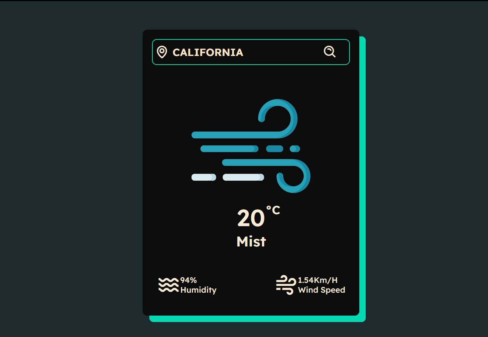
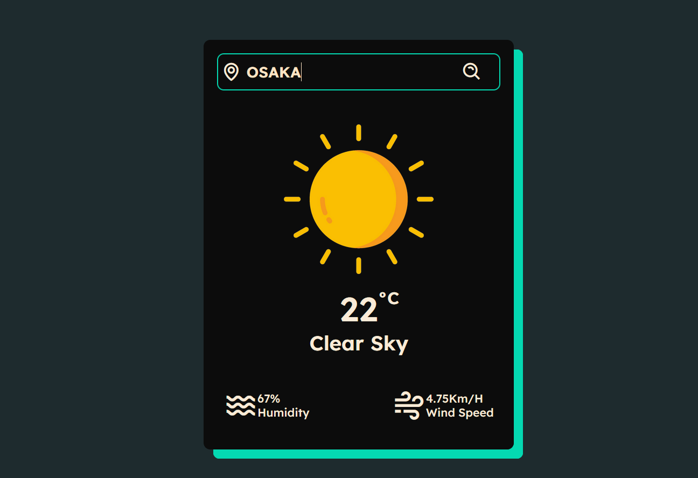
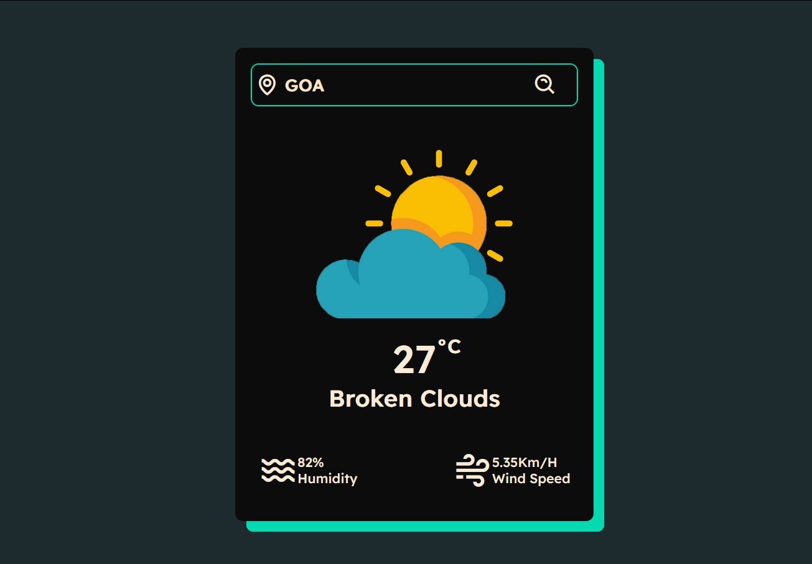

# Weather App



## Overview

The Weather App is a simple and intuitive web application that allows users to search for current weather information by city. It provides real-time data such as temperature, weather conditions, humidity, and wind speed. The app also displays relevant weather icons based on the conditions.

## Features

- **Real-Time Weather Data**: Fetches the latest weather information using the OpenWeatherMap API.
- **Responsive Design**: The app is fully responsive and works on various devices, from desktops to mobile phones.
- **Weather Icons**: Displays different icons based on the weather condition (e.g., clouds, clear sky, rain, mist, snow).
- **Error Handling**: Notifies the user if the city is not found or if there is a problem with fetching data.

## Screenshots

### Example of "Clear" Weather


### Example of "Rainy" Weather


### Example of "Error Query" Weather


## Getting Started

To get a local copy up and running, follow these simple steps.

### Prerequisites

You will need a web browser and a code editor to view and edit the files.

### Installation

1. **Clone the repository**:

   ```bash
   git clone https://github.com/animiiexe/Weather-app.git
